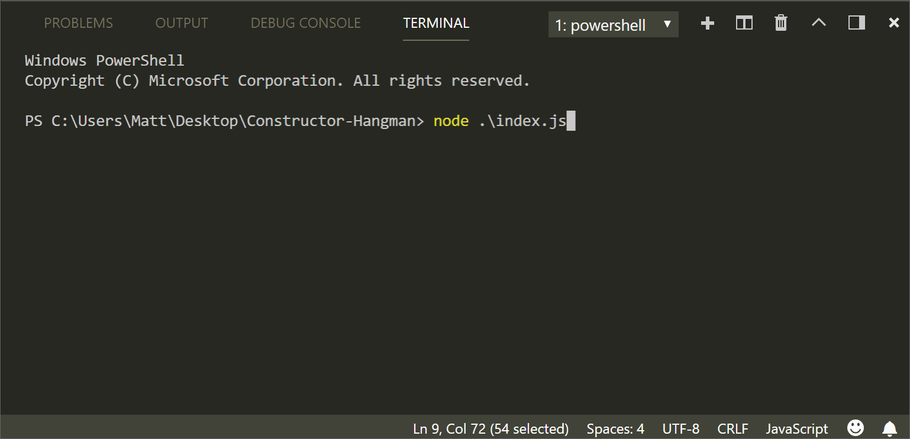

# Constructor-Hangman

### Play hangman in the terminal.
The game receives user input using the inquirer package and relies on constructors and prototypes to run.
The game has three files that are built on a system of dependencies:
* **Letter.js**: Contains a constructor, *Letter*. The Letter constructor displays the actual letter or a blank, depending on whether or not the user has guessed the letter. *Letter* defines:
  * A string value to store the actual character for the letter
  * A boolean value that stores whether that letter has been guessed yet
  * A function that returns the underlying character if the letter has been guessed, or a blank if the letter has not been guessed
  * A function that takes a character as an argument and checks it against the underlying character, updating the stored boolean value to true if it was guessed correctly

* **Word.js**: Contains a constructor, *Word*, that depends on the Letter constructor. The Word constructor is used to create an object representing the current word the user is attempting to guess. *Word* defines:
  * An array of `new` Letter objects that represent the letters of the current word
  * A function that returns a string representing the current word, and calls the *Letter* function to see if the character has been guessed on each letter object and then displays the characters or underscores and concatenate those together.
  * A function that takes a character as an argument and calls the guess function from *Letter* on each letter object

* **index.js**: The file containing the logic for the course of the game, which depends on `Word.js` and:
  * Randomly selects a word and uses the `Word` constructor to store it
  * Prompts the user for each guess and keeps track of the user's remaining guesses
  * Checks for win/loss conditions and records them
  * Prevents user from using the same key

### Languages Used
* JavaScript
* Nodejs

### Required Node packages and other sources
* [Inquirer.js](https://www.npmjs.com/package/inquirer#examples)
* [colors.js](https://www.npmjs.com/package/colors)

### To Do
- [ ] Allow words with spaces in word bank by preventing white space from counting as letter object.
- [ ] Refactor guess conditions to deduct guesses remaining *only* on incorrect guesses.
- [ ] Add `gauntlet` option that challenges user to correctly guess all words from word bank without a loss.
